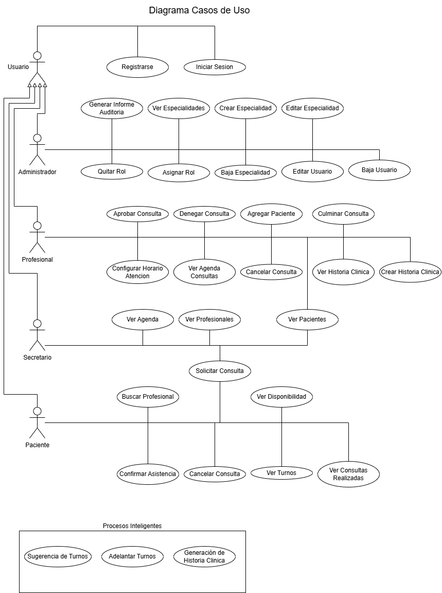

# 🟦 Fase de Análisis – Proyecto ALMA
> Refinar los **requisitos**, crear representaciones más estructuradas del comportamiento del sistema, y responder claramente a qué debe hacer el sistema.

### ✅ 1. Diagrama de Casos de uso

# Sistema ALMA

## Descripción general

| Actor                         | Descripción                                                                 |
|------------------------------|-----------------------------------------------------------------------------|
| **Usuario**            | Se registra e inicia sesion en el sistema. Automaticamente se le asigna rol de Paciente             |
| **Secretario**            | Administra turnos, Consulta profesionales disponibles, Consulta pacientes y verifica disponibilidad de turnos.             |
| **Profesional**              | Consulta información del paciente, confirma/cancela consultas y crea o visualiza historial clínico. |
| **Paciente**                 | Solicita/Recibe turnos, recibe sugerencia de turnos, y accede a su historial de consultas. |
| **Administrador del sistema**| Gestiona usuarios, roles, especialidades y configuración general.           |

---

## Problemas Identificados

- Falta de centralización de la información médica.
- Gestión manual y propensa a errores de turnos o faltas por parte de pacientes.
- Dificultad para acceder al historial clínico.
- No se realizan recordatorios o notificaciones de los turnos.
- Registro de consultas a mano alzada.

## Necesidad

Se necesita desarrollar un sistema web que unifique estos procesos, permitiendo un flujo de trabajo más ágil, seguro y accesible tanto para los profesionales como para el personal administrativo.

---

### ✅ 2. Documento de Requisitos (funcionales y no funcionales)

# Documento de Requisitos – Sistema ALMA

## Requisitos Funcionales (RF)

- RF01: El sistema debe permitir registrar y modificar datos de pacientes.
- RF02: El sistema debe permitir registrar y modificar datos de profesionales.
- RF03: El sistema debe permitir la asignación y gestión de Consultas.
- FT04: El sistema debe incluir agenda personalizada por profesional.
- RF05: El sistema debe permitir la busqueda de consultas por profesional, fecha y especialidad.
- RF06: El sistema debe permitir el registro autónomo de usuarios, asignándoles el rol correspondiente con acceso limitado a funciones específicas.
- RF07: El sistema debe registrar consultas médicas y asociarlas al paciente.
- RF08: El sistema debe generar y visualizar el historial clínico.
- RF09: El sistema debe enviar recordatorios de turnos automáticamente.
- RF10: El sistema debe permitir a los administradores gestionar usuarios y roles.

## Requisitos No Funcionales (RNF)

- RNF01: El sistema será para plataformas webs.
- RNF02: El acceso a los datos debe estar protegido mediante autenticación.
- RNF03: Escalabilidad para incorporar nuevas funcionalidades.

---

### ✅ 3. Actores Identificados

| Actor                         | Descripción                                                                 |
|------------------------------|-----------------------------------------------------------------------------|
| **Secretario**            | Administra turnos, pacientes, y realiza tareas administrativas.             |
| **Profesional**              | Consulta información del paciente, registra consultas y visualiza historial clínico. |
| **Paciente**                 | Recibe turnos, recordatorios, y accede a su historial (si está habilitado). |
| **Administrador del sistema**| Gestiona usuarios, roles, especialidades y configuración general.           |

---

### ✅ 4. Casos de Uso de Alto Nivel

| Caso de uso                            | Actor         | Descripción breve                                                                 |
|----------------------------------------|---------------|-----------------------------------------------------------------------------------|
| Gestionar pacientes                    | Secretaria | Alta, baja, modificación y búsqueda de pacientes.                                 |
| Gestionar profesionales                | Administrador | Administración de datos de los profesionales y sus especialidades.               |
| Gestion de turnos                         | Secretaria | Crear, modificar y eliminar turnos para pacientes con profesionales.                        |
| Registrar consulta                     | Profesional   | Registrar motivo, evolución, diagnóstico y tratamiento del paciente.              |
| Consultar historial clínico            | Profesional   | Acceder al historial clínico de un paciente.                                      |
| Acceder a sus turnos                  | Paciente      | Ver turnos asignados y/o cancelarlos.                 |
| Gestionar usuarios y permisos          | Administrador | Crear, editar o eliminar cuentas y roles del sistema.                             |
| Consultar Agenda          | Profesional | Acceder a su agenda de turnos.                             |
