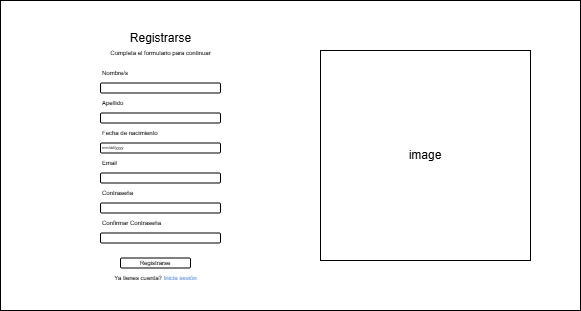

### Caso de Uso: Registrarse
- **Actor principal:** Usuario
- **Resumen:** El usuario se registra en el sistema proporcionando sus datos personales y credenciales de acceso.
- **Precondiciones:**
  - El usuario no debe estar registrado previamente.
  - El sistema debe estar en línea y operativo.
- **Flujo principal:**
  1. El usuario accede a la opción "Registrarse" desde la pantalla de inicio.
  2. El sistema muestra un formulario de registro.
  3. El usuario completa los campos requeridos (nombre, apellido, email, contraseña, etc.).
  4. El usuario envía el formulario.
  5. El sistema valida los datos y crea la cuenta.
  6. El sistema notifica al usuario que la cuenta fue creada exitosamente.
  7. El sistema redirige al usuario a Iniciar Sesion.
- **Flujos alternativos:**
  - 3a. El email ya está registrado: el sistema notifica al usuario.
  - 5a. Los datos ingresados son inválidos: el sistema notifica los errores al usuario.
- **Postcondiciones:**
  - El usuario queda registrado en el sistema y puede iniciar sesión.

---

